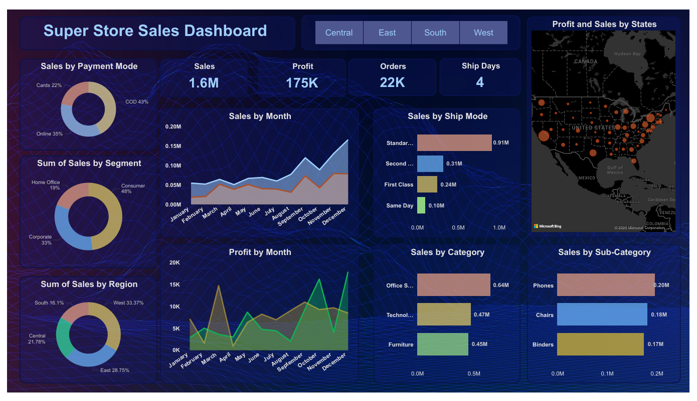
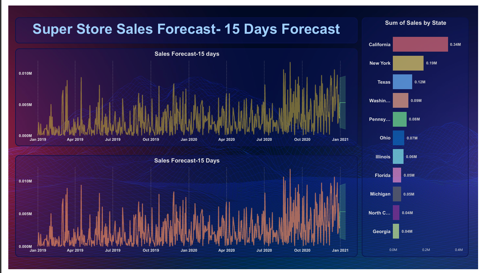

🏬 SuperStore Sales Analytics & Forecasting – Power BI

📌 Project Overview

This project presents an interactive Power BI dashboard built using the SuperStore Sales dataset.
The dashboard focuses on sales performance analysis, time-series forecasting, and actionable business insights to support strategic decision-making for a supermarket business.

The solution combines historical sales analysis with 15-day sales forecasting to help businesses improve growth, efficiency, and customer satisfaction.

🎯 Objectives

Analyze overall sales, profit, orders, and shipping performance

Identify key sales trends across categories, regions, and segments

Perform time series analysis for accurate 15-day sales forecasting

Provide actionable insights and recommendations for business growth

🧾 Dataset Description

The SuperStore dataset contains historical sales data with the following key fields:

Order ID, Order Date, Ship Date

Customer Name, Segment, Region, State

Category, Sub-Category, Product Name

Sales, Profit, Quantity, Discount

Ship Mode, Payment Mode

📊 Dashboard Features

🔹 KPIs

Total Sales

Total Profit

Total Orders

Average Shipping Days

🔹 Visual Analytics

Sales by Category & Sub-Category

Sales and Profit Trends (Monthly)

Sales by Region & State (Map View)

Sales by Segment & Ship Mode

Payment Mode Distribution

🔹 Forecasting

15-Day Sales Forecast using time series analysis

🔹 Interactivity

Filters for Date, Region, Category, Segment, Ship Mode

📈 Sales Forecasting

Historical sales data used for time-series forecasting

Forecast generated for next 15 days

Helps anticipate demand and plan inventory & operations effectively

## 📷 Dashboard Preview

🧠 Key Insights & Findings

West and East regions contribute the highest sales

Technology and Office Supplies are top-performing categories

Sales peak during year-end months

Consumer segment dominates overall sales

COD is the most preferred payment mode

Forecast indicates stable short-term sales growth

🛠 Tools & Technologies

Power BI Desktop – Dashboard creation & visualization

Power Query – Data cleaning & transformation

DAX – KPI and business metric calculations

Excel / CSV – Data source

✅ Conclusion

This SuperStore Sales Analytics dashboard provides a 360-degree view of business performance.
By combining historical analysis with sales forecasting, it enables data-driven decisions that improve:

Revenue planning

Operational efficiency

Customer satisfaction

Strategic growth initiatives

